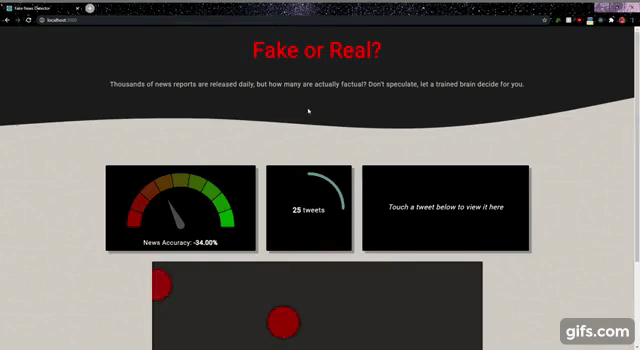

# Fake-Tweet-Visualizer

Most fake news detection datasets provide full news articles. Since we wanted to classify tweets, we needed data that looked a bit more tweet-like. We used the Fake News Inference Dataset, which provides one-sentence statements from news articles labelled by Politifact as "fake" or "real". While these do not perfectly resemble tweets, they were closer than the other options we found. We used this dataset to build a model using binary Naive Bayes model, and created an application implementing the model and pulling tweets from a twitter stream. The application shows the news accuracy, number of tweets processed and an interface to interact with the tweets. By hovering over the rolling dots, we are able to see exactly what the tweet is. Additionally, the dots are also coloured to match the news accuracy widget to indicate if the tweet is true or false.

**Fake-Tweet-Visualizer** is based on **bluebird** (see upstream remote) and conducts analysis and visualizes tweets being sent on Twitter in Real-Time. 

Live link to the application coming soon!

## Demo

## Backend

The backend is hosted at : https://github.com/preyansh98/Fake-Tweet-Detection
